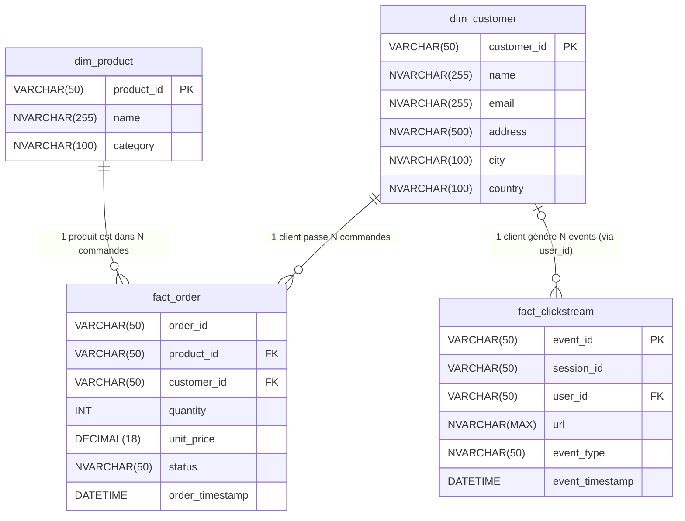
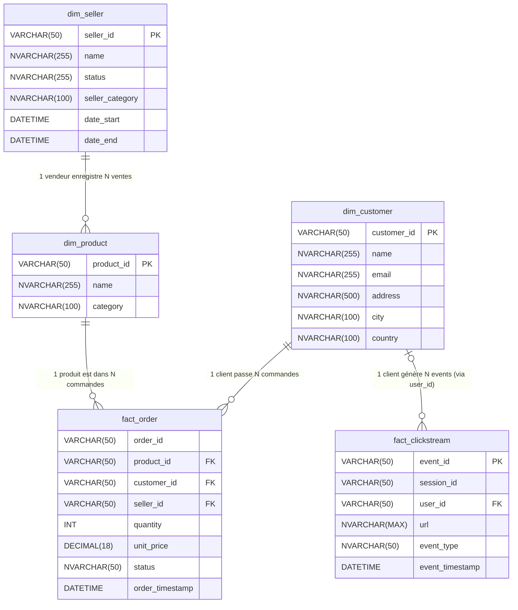

schéma md du DWH actuel :

suivi des vendeurs dans le temps 
- créer une dimension vendeur avec un SCD de type 2 (pour suivre les états de chaque vendeur dans le temps)
- un scd de type 2 permet de conserver l'historique des changements de statut des vendeurs (création de nouvelles lignes avec dates et statuts)
> lister les informations liées aux vendeurs 
- colonnes liées au vendeur lui-même : profil, statut, catégorie
- colonnes techniques pour la gestion du SCD :
  - horodatage des changements avec date début et date fin, 
  - colonnes de flag actif/inactif car plusieurs lignes pour un même vendeur)

- WARNING
- une commande peut être multi-vendeurs (c'est le cas sur amazon par exemple)
- 

# schéma proposition d'évolution du DWH

## pourquoi choisir de relier la table dim_seller à fact_order et non à dim_product sachant qu'une commande peut-être multi-vendeur, on pourrait ?
- dans le cadre d'une marketplace, je n'arrive pas à statuer sur à quelle table relier la table seller, order ou produits, moi je pense à produit car pour moi les seller sont avant tout fournisseurs (comme sur amazon) et une commande pourrait etre multi vendeur ?
C'est une excellente intuition de penser "Fournisseur", mais dans une modélisation décisionnelle (Data Warehouse) pour une Marketplace type Amazon, la réponse est **`fact_order`**.

Voici pourquoi ton intuition de relier à `dim_product` te bloquerait techniquement :

**1. Le problème du "Produit Unique" vs "Vendeurs Multiples"**
Sur une Marketplace, le produit "iPhone 15 Noir 128Go" est unique (il a un code EAN unique). C'est ta ligne dans `dim_product`.
Cependant, ce *même* produit peut être vendu par 10 vendeurs différents (Apple, Fnac, VendeurTiers_XYZ).
* Si tu mets la clé vendeur dans `dim_product`, tu es obligé de dupliquer la ligne produit 10 fois (une par vendeur). Tu casses l'unicité de ton référentiel produit.

**2. La granularité de la commande (Fact Order)**
Ta table `fact_order` ne représente pas le "panier" global, mais bien la **ligne de commande** (un produit acheté).
Si une commande est multi-vendeurs :
* Ligne 1 : iPhone (lié à `dim_product`) -> acheté au vendeur A (lié à `dim_seller`).
* Ligne 2 : Coque (liée à `dim_product`) -> achetée au vendeur B (lié à `dim_seller`).

**Conclusion :**
C'est la **transaction** qui scelle le lien entre un produit et un vendeur à un instant T. Le lien doit donc se faire dans la table de faits.

**Verdict :** Relie `dim_seller` à **`fact_order`**.