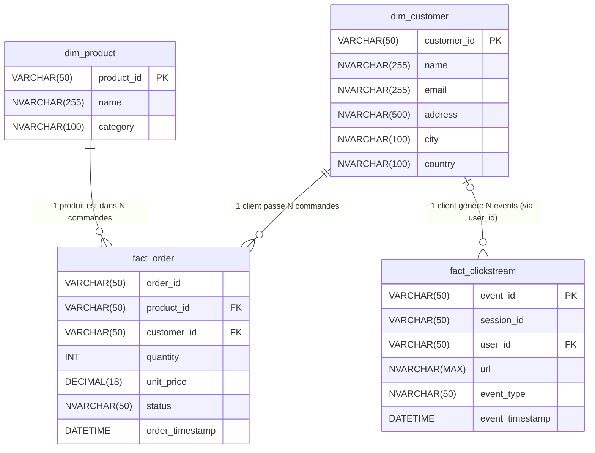
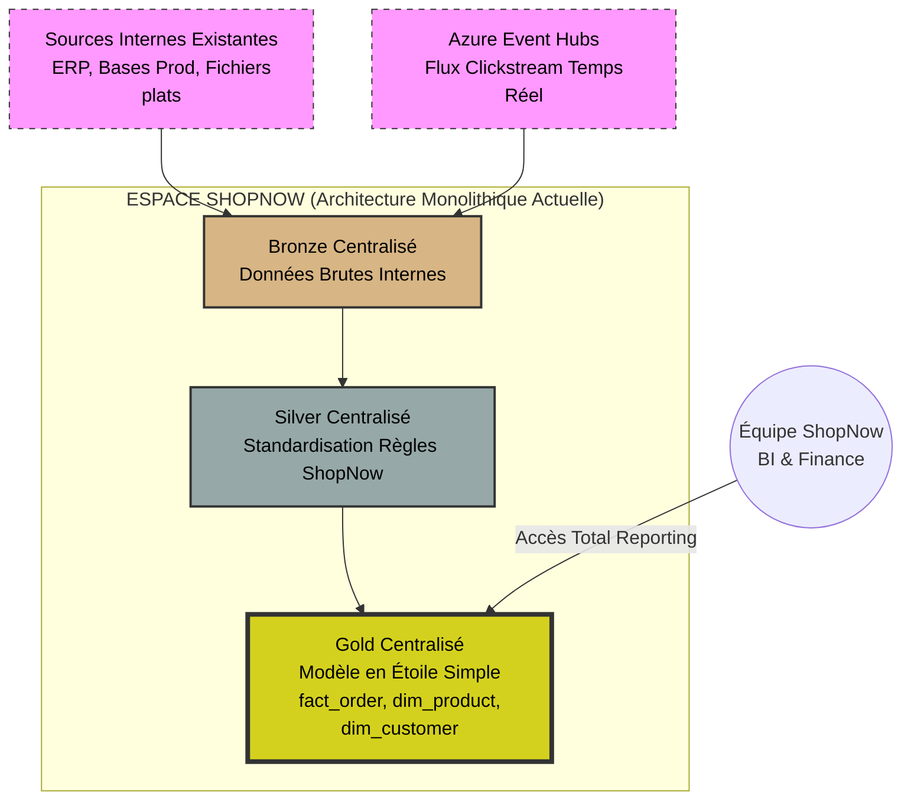
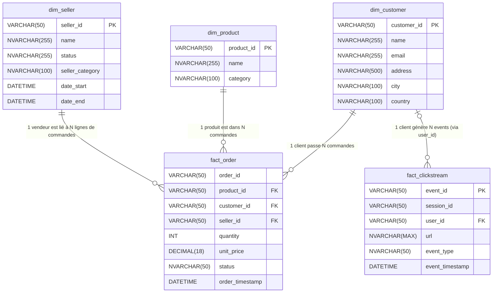
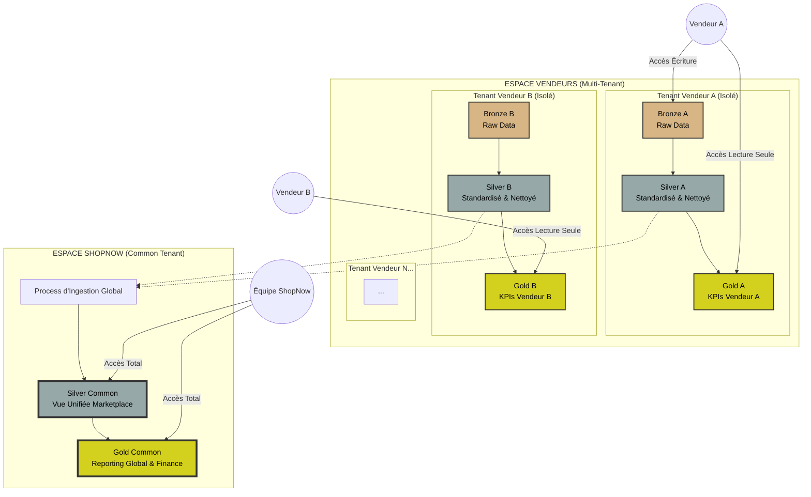
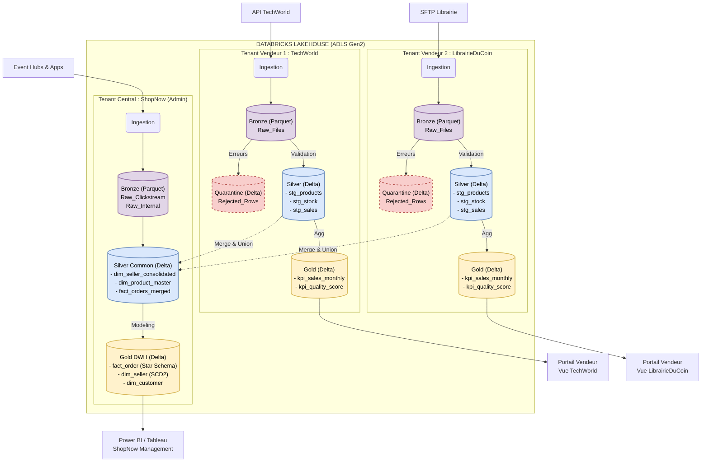
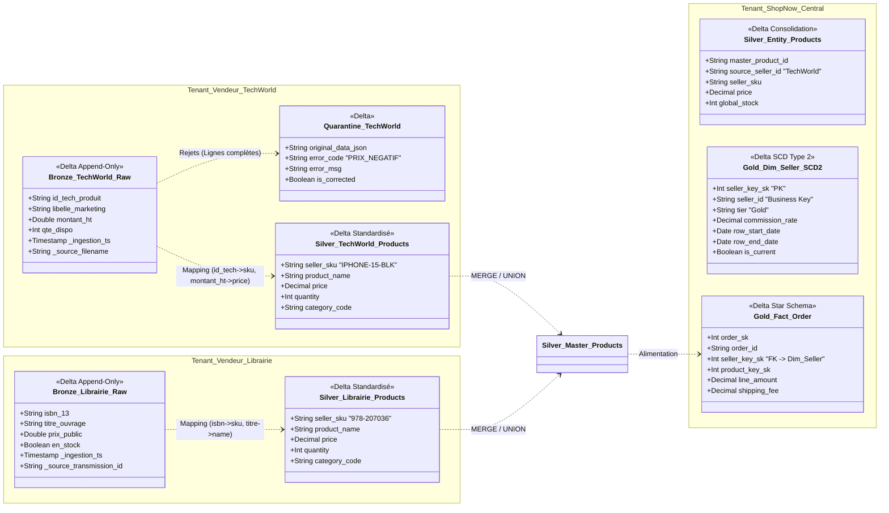

## Gestion du suivi des vendeurs dans le temps

schéma mermaid du Datawarehouse actuel :

schéma mermaid du DWH actuel (version dataflow) :

### proposition :
- créer une dimension vendeur (une table dédiée, dim_seller)
- lui associer un SCD de type 2 (pour suivre les états de chaque vendeur dans le temps)
- un scd de type 2 permet de conserver l'historique des changements de statut des vendeurs (création de nouvelles lignes avec dates et statuts)

> lister les informations liées aux vendeurs 
- colonnes liées au vendeur lui-même : profil, statut, catégorie
- colonnes techniques pour la gestion du SCD :
  - horodatage des changements avec date début et date fin, 
  - colonnes de flag actif/inactif car plusieurs lignes pour un même vendeur)

- POINTS D'ATTENTION :
- une commande peut être multi-vendeurs (c'est le cas sur amazon par exemple)

### schéma proposition d'évolution du DWH

## Gouvernance des données et scalabilité de l'architecture de données du DWH

### brique 1 : imposer un data model strict pour standardiser les données envoyées par les vendeurs
> concrètement : **définir un schéma de données précis** (types, formats, contraintes) que chaque vendeur doit respecter lors de l'envoi de ses données.

Cette proposition permet de standardiser les données reçues et de faciliter leur intégration dans le DWH, de limiter ainsi les erreurs liées à des formats inattendus.
en effet, si chaque vendeur envoie des données dans un format différent, ou si chaque vendeur change dans le temps le format de ses données, cela complique l'intégration et augmente les risques d'erreurs
Cette solution permet de prévenir les erreurs dès la source selon le principe de la "qualité à la source"

### brique 2 : aiguillage des données dès l'ingestion (données conformes vs non conformes)
- objectif : faire la différence entre les erreurs bloquantes (données manquantes, format incorrect) et les erreurs non bloquantes (valeurs inhabituelles mais acceptables):
erreur bloquante : champ obligatoire manquant, type de données incorrect (ex : texte au lieu de nombre), prix négatif, vendeur inconnu, etc.
erreur non bloquante : espace en trop, erreur de casse, format de date US/FR, etc.

> concrètement : **scan automatisé des données dès l'ingestion**
- les données conformes sont intégrées dans le DWH
- les données non conformes sont mises en quarantaine pour analyse ultérieure, dans une table dédiée, exemple : quarantine_seller_data

le scan automatisé lève 2 types d'alertes :
- soft/business  : valeurs inhabituelles mais acceptables (ex : prix très bas, quantité élevée), statistique (par exemple un gros écart par rapport à la moyenne historique)
- hard/technical : complétude (ex: données manquantes pour une colonne), schéma (ex: type de données incorrect), unicité (ex: doublons)

> Concrètement : 1 quarantaine des données non conformes, 1 flag dans le DWH pour les données suspectes

- si le scan lève une erreur soft, les données sont intégrées dans le DWH avec un tag d'avertissement (is_suspicious = true) pour permettre une analyse ultérieure par les équipes métiers
- si le scan détecte des erreurs bloquantes, les données sont mises en quarantaine dans la table dédiée

### sous-brique 2.b : gestion de la qualité des données en 3 temps et scalabilité
la conformité des données a été pensée en 3 temps, considérant que les vendeurs intègreront progressivement la marketplace ainsi que les exigences de qualité des données.
L'objectif est de responsabiliser les vendeurs sur la qualité de leurs données tout en minimisant la charge opérationnelle interne.
Concrètement de notre côté, on cherche à ne pas construire une usine à gaz dès le départ, mais à évoluer progressivement vers un système plus automatisé et self-service.
Le cadre définit suit la croissance du nombre de vendeurs et le processus technique évolue à mesure que le business de la Marketplace grandit.

#### temps 1 : gérer la quarantaine des données non conformes (<10 vendeurs)
- Identifier et isoler les données problématiques
Grâce à un système de quarantaine des données non conformes au schéma défini, on peut isoler les données problématiques pour analyse et correction ultérieure.

- Lorsque les données sont mises en quarantaine, un script scanne la table de quarantaine toutes les heures, un rapport d'erreurs est généré lorsque des lignes sont placées en quarantaine. 
- Il détaille les problèmes détectés (type d'erreur, ligne concernée, vendeur concerné, etc.)
- ce rapport est envoyé aux équipes responsables de la qualité des données pour correction et communication avec le fournisseur de la donnée (ici les vendeurs marketplaces)

#### temps 2 :  pour une gestion automatisée de la quarantaine (entre 10 et 100 vendeurs)
La marketplace grandissant, elle peut avoir des centaines de vendeurs, 
et pour assurer la scalabilité de la marketplace, on peut envisager une gestion automatisée de la quarantaine :
- Le vendeur envoie son fichier de données
- Des données non confomes (bloquantes) sont mises en quarantaine
- un rapport d'erreurs est généré et envoyé automatiquement au vendeur pour quelle puisse corriger et renvoyer les données corrigées

#### temps 3 : pour une gestion en self-service de la qualité des données par les vendeurs (plus de 100 vendeurs)
- le vendeur peut accéder à un portail en self-service où il peut consulter les rapports d'erreurs liés à ses données
- il peut corriger et renvoyer les données corrigées via ce portail
- le système de quarantaine traite automatiquement les nouvelles données envoyées par le vendeur
- le vendeur peut suivre en temps réel la qualité de ses données et prendre des mesures correctives rapidement
- cela réduit la charge sur les équipes internes et responsabilise les vendeurs quant à la qualité de leurs données

## Intégration de nouvelles sources externes

ShopNow souhaite recevoir des informations complémentaires depuis les systèmes des vendeurs, notamment (les niveaux de stock, les mises à jour de produits, les disponibilités)
Certaines de ces informations proviendront d’API externes ou de systèmes hétérogènes

### proposition : mettre en place une architecture d'ingestion hybride :

> les données chaudes (stocks, disponibilités) doivent être en temps réel (critique) pour éviter la vente de produits en rupture de stock
- en effet on ne peut pas vendre un produit qui n'est pas disponible. 
- format des données : on impose aux vendeurs un format JSON standardisé pour l'API

> les données froides (catalogue produits) peuvent être intégrées en batch, avec un délai d'un jour (J+1)
- en effet, les mises à jour de catalogue produits ne sont pas critiques en temps réel. Un délai d'un jour est acceptable pour la plupart des cas d'usage.
- format des données : on accepte des fichiers plats (CSV, XML) pour la flexibilité
- on impose un schéma de données précis pour standardiser les données envoyées par les vendeurs
- on met en place un processus ETL/ELT pour transformer et charger les données dans le DWH, ce qui permet de gérer des formats hétérogènes via une étape de mapping (exemple: les colonnes sources prod_name ou nom_article rempliraient la colonne de destination product_name)

| Type de Données         | Contrainte                             | Pattern d'Intégration        |Justification|
|:------------------------|:---------------------------------------|:-----------------------------| :--- |
| Stocks & Disponibilités | Temps Réel (Critique)                  | API Gateway (Push)           |Le vendeur pousse la modification de stock vers ShopNow via une API standardisée. Évite la latence.|
| Catalogue Produits      | Volumétrie / J+1| Batch (SFTP / Storage)       |"Dépôt de fichiers plats. Permet de gérer des formats hétérogènes (CSV, XML) via une étape de mapping dans l'ELT."|

4. Sécurité et cloisonnement des données
Nous proposons une approche en **"Data Alliance"** qui est pertinent pour garantir la sécurité et la confidentialité des données entre concurrents (les vendeurs), grâce au cloisonnemnent des données par vendeur,
tout en permettant à l'opérateur qui centralise les informations (ShopNow) de tout consolider.

Son architecture est basée sur **l'isolation par conteneur (Logical Multi-Tenancy)** sur un Data Lake.

- chaque vendeur dispose d'un espace de données dédié dans le DWH, accessible uniquement par lui-même et les équipes internes autorisées sous la forme d'un TENANT par vendeur
- les données opérationnelles et analytiques sont segmentées par vendeur, garantissant que chaque vendeur ne voit que ses propres informations
- les équipes internes de ShopNow conservent une vue globale via des rôles d'accès spécifiques et une zone de données agrégée (silver)

### Plus de détail au sujet des Zones dans chaque Tenant :

#### Les Tenants Vendeur (L'espace restreint par vendeur)

C'est une structure de dossiers ou conteneurs (sur Azure Data Lake Gen2 ou S3) dédiée à chaque `Seller_ID`.
Chaque vendeur a accès uniquement à son propre tenant.

  * **Zone Bronze (Landingzone)** :

      * **Accès :** Vendeur (Écriture), ShopNow (Écriture).
      * **Processus :** Un pipeline ETL/ELT lit ces fichiers bruts pour les transformer et les charger dans la table Bronze.
      * **Contenu :** Fichiers bruts déposés par le vendeur (CSV, JSON, XML) ou poussés par API.
      * **Exemple :** `produits_vendeur_Machin_26112025.csv` (avec des colonnes mal nommées).

  * **Zone Silver (Standardisation Locale)** :

      * **Accès :** ShopNow (Lecture/Écriture), Vendeur (Lecture seule).
      * **Processus :** Un script ShopNow tourne ici pour appliquer le Data Model. Dans le DWH, on renomme les colonnes, on caste les types.
      * **Contenu :** Données propres mais limitées aux données de CE vendeur uniquement.
      * **Exemple :** Table Delta `products` avec colonnes standardisées (`product_id`, `price`, `stock`).

  * **Zone Gold (Reporting Vendeur)** :

      * **Accès :** Vendeur (Lecture via Portail), ShopNow (Lecture/Écriture).
      * **Contenu :** Les agrégats pré-calculés pour le vendeur. C'est ce qui alimente son tableau de bord dans le portail "Seller Center".
      * **Exemple :** "Mes ventes du mois", "Mon taux de retour".

#### Le Tenant ShopNow (L'espace exclusivement réservé à ShopNow)

C'est la zone qui est interdite aux vendeurs de la marketplace. C'est ici que se trouve le Data Warehouse global.

  * **Ingestion "Many-to-One" :**

      * Un pipeline ETL vient lire toutes les tables **Silver** des vendeurs (A, B, C...).
      * Il les fusionne (UNION ALL) en ajoutant une colonne `source_seller_id` et `source_seller_name` pour tracer l'origine de chaque ligne.
      * des colonnes techniques sont ajoutées (horodatage de l'ingestion).

  * **Zone Silver (Consolidation)** :

      * C'est ici qu'on gère les dédoublonnages globaux.
      * *Exemple :* La table `dim_product_global`. Si le Vendeur A et le Vendeur B vendent le même produit (même EAN), c'est ici qu'on le détecte.

  * **Zone Gold (Décisionnel)** :

      * Modèle en étoile complet pour ShopNow.
      * Calcul des commissions, marge globale, performance comparée des vendeurs.

-----

### schéma mermaid récapitulatif de l'architecture multi-tenant proposée

### schéma mermaid avec une vue des tables Delta dans chaque Tenant

### Points forts de cette architecture :

- Isolation des données : En gérant les droits d'accès au niveau du dossier racine du Tenant Vendeur (RBAC), nous garantissons techniquement qu'un vendeur ne pourra jamais, même par erreur de requête, accéder aux données d'un autre.
- Scalabilité : Si le Vendeur A envoie 1 To de données et le Vendeur B 1 Ko, cela n'impacte pas la performance des autres. Nous pouvons même allouer des ressources de calcul dédiées par tenant si besoin. 
- Traçabilité (grâce au Lineage) : Si une donnée est fausse dans le Gold Commun, il est possible remonter la chaîne : depuis Gold > silver vendeur > raw vendeur. Nous pouvons retrouver exactement quel fichier source est coupable. 
- Monétisation : A terme, shopnow pourra proposer aux vendeurs marketplace d'accéder à des données anonymisées du "Gold Common" (benchmarking : "Comment je me situe par rapport à la moyenne du marché ?").

### ANNEXES

## pourquoi choisir de relier la table dim_seller à fact_order et non à dim_product sachant qu'une commande peut-être multi-vendeur
--> on pourrait considérer les vendeurs comme des fournisseurs de produits et relier les produits aux vendeurs ?

Plusieurs problèmes techniques se posent si on relie `dim_seller` à `dim_product` :

**A. Le problème du "Produit Unique" vs "Vendeurs Multiples"**
Sur une Marketplace, le produit "iPhone 15 Noir 128Go" est unique (il a un code EAN unique). C'est ta ligne dans `dim_product`.
Cependant, ce *même* produit peut être vendu par 10 vendeurs différents (Apple, Fnac, VendeurTiers_XYZ).
* Si tu mets la clé vendeur dans `dim_product`, tu es obligé de dupliquer la ligne produit 10 fois (une par vendeur). Tu casses l'unicité de ton référentiel produit.

**B. La granularité de la commande (Fact Order)**
La table `fact_order` ne représente pas le "panier" global, mais la **ligne de commande** (un produit acheté).
Si une commande est multi-vendeurs :
* Ligne 1 : iPhone (lié à `dim_product`) -> acheté au vendeur A (lié à `dim_seller`).
* Ligne 2 : Coque (liée à `dim_product`) -> achetée au vendeur B (lié à `dim_seller`).

**Conclusion :**
C'est la **transaction** qui scelle le lien entre un produit et un vendeur à un instant T. 
Le lien doit donc se faire dans la table de faits.
Il faut relier `dim_seller` à **`fact_order`**.

Plan pour rédaction : 

I. diagnostic : Analyse et limites de l’architecture actuelle :
- analyse de l’architecture existante du Data Warehouse (ce qu'elle permet actuellement)
- identification des nouveaux enjeux (historisation des vendeurs, volume et variété des données, granularité)
- risques liés à la transformation en Marketplace (tracabilité, qualité des données, sécurité des données)

II. propositions d’évolutions : Adaptations structurelles et techniques :
modifications du modèle de données (ajout de dimension vendeur, adaptation de la table de faits, gestion des SCD) 
+ justifier pourquoi on utilise une clé technique de versionnage vendeur (seller_key) = pour figer l'état du vendeur lors de la vente, 
+ et pourquoi une clé métier seller_id : identifiant unique du vendeur, reste constante dans le temps

ce modèle permet une souplesse d’analyse et une traçabilité des transactions : 
- pour les vendeurs : 
- il permet d’isoler les données par vendeur pour des analyses ciblées (par produit etc.)
- 
- il facilite la gestion des évolutions des vendeurs dans le temps (pour Shopnow)
