## Gestion du suivi des vendeurs dans le temps

schéma mermaid du Datawarehouse actuel :

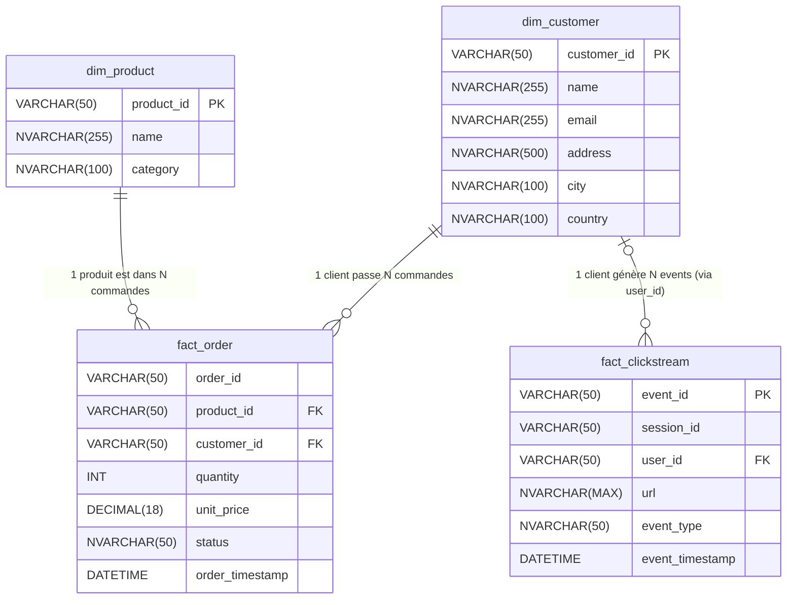
```mermaid
erDiagram
    %% Relations
    dim_customer ||--o{ fact_order : "1 client passe N commandes"
    dim_product ||--o{ fact_order : "1 produit est dans N commandes"
    dim_customer |o--o{ fact_clickstream : "1 client génère N events (via user_id)"

    %% Table: dim_customer
    dim_customer {
        VARCHAR(50) customer_id PK
        NVARCHAR(255) name
        NVARCHAR(255) email
        NVARCHAR(500) address
        NVARCHAR(100) city
        NVARCHAR(100) country
    }

    %% Table: dim_product
    dim_product {
        VARCHAR(50) product_id PK
        NVARCHAR(255) name
        NVARCHAR(100) category
    }

    %% Table: fact_order
    fact_order {
        VARCHAR(50) order_id
        VARCHAR(50) product_id FK
        VARCHAR(50) customer_id FK
        INT quantity
        DECIMAL(18) unit_price
        NVARCHAR(50) status
        DATETIME order_timestamp
    }

    %% Table: fact_clickstream
    fact_clickstream {
        VARCHAR(50) event_id PK
        VARCHAR(50) session_id
        VARCHAR(50) user_id FK
        NVARCHAR(MAX) url
        NVARCHAR(50) event_type
        DATETIME event_timestamp
    }
```

schéma mermaid du DWH actuel (version dataflow) :

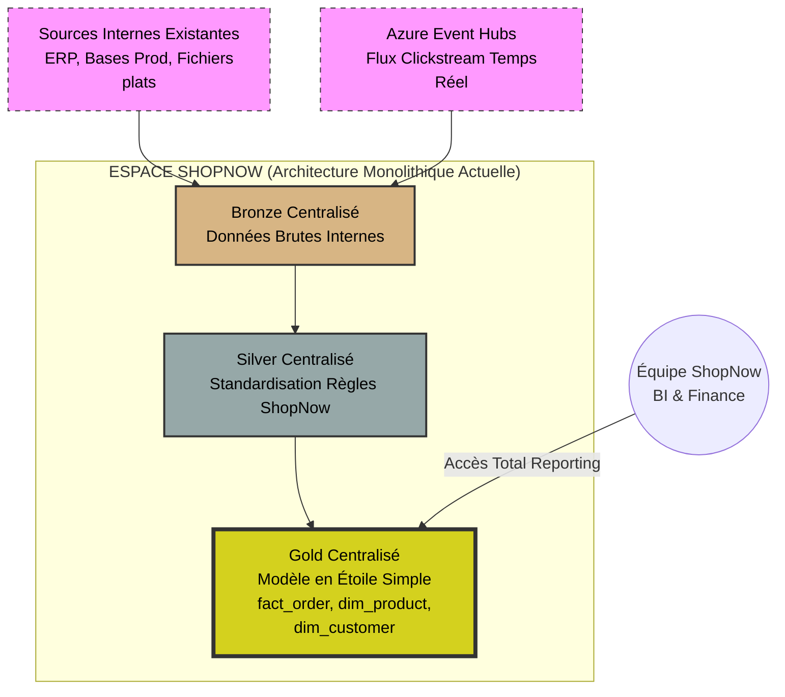
```mermaid
graph TD
    %% --- Sources ---
    Src_Int[Sources Internes Existantes\n ERP, Bases Prod, Fichiers plats]
    Src_EH[Azure Event Hubs\n Flux Clickstream Temps Réel]

    %% --- LE MONOLITHE CENTRALISÉ ---
    subgraph "ESPACE SHOPNOW (Architecture Monolithique Actuelle)"
        direction TB
        
        %% Bronze : Point d'entrée unique
        B_Legacy[Bronze Centralisé\nDonnées Brutes Internes]
        
        %% Silver : Transformation unique
        S_Legacy[Silver Centralisé\nStandardisation Règles ShopNow]
        
        %% Gold : Le modèle simple actuel
        G_Legacy[Gold Centralisé\nModèle en Étoile Simple\n fact_order, dim_product, dim_customer]
        
        %% Flux linéaire
        B_Legacy --> S_Legacy --> G_Legacy
    end

    %% --- Alimentation ---
    Src_Int --> B_Legacy
    Src_EH --> B_Legacy

    %% --- Utilisateurs ---
    %% Seuls les internes ont accès.
    UserSN((Équipe ShopNow\nBI & Finance)) -->|Accès Total Reporting| G_Legacy

    %% --- STYLING (Réplique exacte du style de ton schéma cible) ---
    %% Couleurs Bronze / Silver / Gold
    style B_Legacy fill:#D7B584,stroke:#333,stroke-width:2px,color:#000
    style S_Legacy fill:#96a8a8,stroke:#333,stroke-width:2px,color:#000
    %% Le Gold central est mis en avant avec un bord épais, comme dans ton exemple
    style G_Legacy fill:#d4d11e,stroke:#333,stroke-width:4px,color:#000
    
    %% Style pour les sources (pour différencier du DWH lui-même)
    style Src_Int fill:#f9f,stroke:#333,stroke-width:1px,color:#000,stroke-dasharray: 5 5
    style Src_EH fill:#f9f,stroke:#333,stroke-width:1px,color:#000,stroke-dasharray: 5 5
```

### proposition :
- créer une dimension vendeur (une table dédiée, dim_seller)
- lui associer un SCD de type 2 (pour suivre les états de chaque vendeur dans le temps)
- un scd de type 2 permet de conserver l'historique des changements de statut des vendeurs (création de nouvelles lignes avec dates et statuts)

> lister les informations liées aux vendeurs 
- colonnes liées au vendeur lui-même : profil, statut, catégorie
- colonnes techniques pour la gestion du SCD :
  - horodatage des changements avec date début et date fin, 
  - colonnes de flag actif/inactif car plusieurs lignes pour un même vendeur)

- POINTS D'ATTENTION :
- une commande peut être multi-vendeurs (c'est le cas sur amazon par exemple)

### schéma proposition d'évolution du DWH

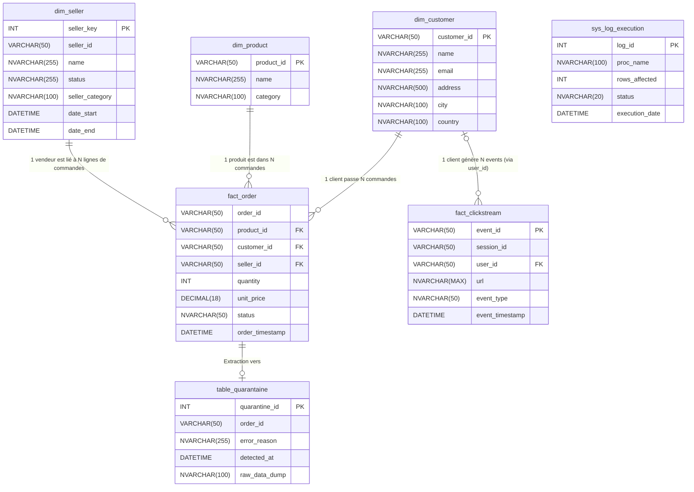
```mermaid
erDiagram
    %% Relations
    dim_customer ||--o{ fact_order : "1 client passe N commandes"
    dim_product ||--o{ fact_order : "1 produit est dans N commandes"
    dim_customer |o--o{ fact_clickstream : "1 client génère N events (via user_id)"
    dim_seller ||--o{ fact_order : "1 vendeur est lié à N lignes de commandes"

    %% Relation de Maintenance
    fact_order ||--o| table_quarantaine : "Extraction vers"

    %% Table: dim_customer
    dim_customer {
        VARCHAR(50) customer_id PK
        NVARCHAR(255) name
        NVARCHAR(255) email
        NVARCHAR(500) address
        NVARCHAR(100) city
        NVARCHAR(100) country
    }

    %% Table: dim_product
    dim_product {
        VARCHAR(50) product_id PK
        NVARCHAR(255) name
        NVARCHAR(100) category
    }

    %% Table: fact_order
    fact_order {
        VARCHAR(50) order_id
        VARCHAR(50) product_id FK
        VARCHAR(50) customer_id FK
        VARCHAR(50) seller_id FK
        INT quantity
        DECIMAL(18) unit_price
        NVARCHAR(50) status
        DATETIME order_timestamp
    }

    %% Table: fact_clickstream
    fact_clickstream {
        VARCHAR(50) event_id PK
        VARCHAR(50) session_id
        VARCHAR(50) user_id FK
        NVARCHAR(MAX) url
        NVARCHAR(50) event_type
        DATETIME event_timestamp
    }
    
     %% Table: dim_seller, 1 ligne par version du vendeur (SCD type 2)
    dim_seller {
        INT seller_key PK
        VARCHAR(50) seller_id
        NVARCHAR(255) name
        NVARCHAR(255) status
        NVARCHAR(100) seller_category
        DATETIME date_start
        DATETIME date_end
    }
    
    %% La table de mise en quarantaine des données non conformes
    table_quarantaine {
        INT quarantine_id PK
        VARCHAR(50) order_id
        NVARCHAR(255) error_reason
        DATETIME detected_at
        NVARCHAR(100) raw_data_dump
    }
    
    %% Table pour le logging des exécutions de procédures stockées
    sys_log_execution {
        INT log_id PK
        NVARCHAR(100) proc_name
        INT rows_affected
        NVARCHAR(20) status
        DATETIME execution_date
    }
```


## Gouvernance des données et scalabilité de l'architecture de données du DWH

### brique 1 : imposer un data model strict pour standardiser les données envoyées par les vendeurs
> concrètement : **définir un schéma de données précis** (types, formats, contraintes) que chaque vendeur doit respecter lors de l'envoi de ses données.

Cette proposition permet de standardiser les données reçues et de faciliter leur intégration dans le DWH, de limiter ainsi les erreurs liées à des formats inattendus.
en effet, si chaque vendeur envoie des données dans un format différent, ou si chaque vendeur change dans le temps le format de ses données, cela complique l'intégration et augmente les risques d'erreurs
Cette solution permet de prévenir les erreurs dès la source selon le principe de la "qualité à la source"

### brique 2 : aiguillage des données dès l'ingestion (données conformes vs non conformes)
- objectif : faire la différence entre les erreurs bloquantes (données manquantes, format incorrect) et les erreurs non bloquantes (valeurs inhabituelles mais acceptables):
erreur bloquante : champ obligatoire manquant, type de données incorrect (ex : texte au lieu de nombre), prix négatif, vendeur inconnu, etc.
erreur non bloquante : espace en trop, erreur de casse, format de date US/FR, etc.

> concrètement : **scan automatisé des données dès l'ingestion**
- les données conformes sont intégrées dans le DWH
- les données non conformes sont mises en quarantaine pour analyse ultérieure, dans une table dédiée, exemple : quarantine_seller_data

le scan automatisé lève 2 types d'alertes :
- soft/business  : valeurs inhabituelles mais acceptables (ex : prix très bas, quantité élevée), statistique (par exemple un gros écart par rapport à la moyenne historique)
- hard/technical : complétude (ex: données manquantes pour une colonne), schéma (ex: type de données incorrect), unicité (ex: doublons)

> Concrètement : 1 quarantaine des données non conformes, 1 flag dans le DWH pour les données suspectes

- si le scan lève une erreur soft, les données sont intégrées dans le DWH avec un tag d'avertissement (is_suspicious = true) pour permettre une analyse ultérieure par les équipes métiers
- si le scan détecte des erreurs bloquantes, les données sont mises en quarantaine dans la table dédiée

### sous-brique 2.b : gestion de la qualité des données en 3 temps et scalabilité
la conformité des données a été pensée en 3 temps, considérant que les vendeurs intègreront progressivement la marketplace ainsi que les exigences de qualité des données.
L'objectif est de responsabiliser les vendeurs sur la qualité de leurs données tout en minimisant la charge opérationnelle interne.
Concrètement de notre côté, on cherche à ne pas construire une usine à gaz dès le départ, mais à évoluer progressivement vers un système plus automatisé et self-service.
Le cadre définit suit la croissance du nombre de vendeurs et le processus technique évolue à mesure que le business de la Marketplace grandit.

#### temps 1 : gérer la quarantaine des données non conformes (<10 vendeurs)
- Identifier et isoler les données problématiques
Grâce à un système de quarantaine des données non conformes au schéma défini, on peut isoler les données problématiques pour analyse et correction ultérieure.

- Lorsque les données sont mises en quarantaine, un script scanne la table de quarantaine toutes les heures, un rapport d'erreurs est généré lorsque des lignes sont placées en quarantaine. 
- Il détaille les problèmes détectés (type d'erreur, ligne concernée, vendeur concerné, etc.)
- ce rapport est envoyé aux équipes responsables de la qualité des données pour correction et communication avec le fournisseur de la donnée (ici les vendeurs marketplaces)

#### temps 2 :  pour une gestion automatisée de la quarantaine (entre 10 et 100 vendeurs)
La marketplace grandissant, elle peut avoir des centaines de vendeurs, 
et pour assurer la scalabilité de la marketplace, on peut envisager une gestion automatisée de la quarantaine :
- Le vendeur envoie son fichier de données
- Des données non confomes (bloquantes) sont mises en quarantaine
- un rapport d'erreurs est généré et envoyé automatiquement au vendeur pour quelle puisse corriger et renvoyer les données corrigées

#### temps 3 : pour une gestion en self-service de la qualité des données par les vendeurs (plus de 100 vendeurs)
- le vendeur peut accéder à un portail en self-service où il peut consulter les rapports d'erreurs liés à ses données
- il peut corriger et renvoyer les données corrigées via ce portail
- le système de quarantaine traite automatiquement les nouvelles données envoyées par le vendeur
- le vendeur peut suivre en temps réel la qualité de ses données et prendre des mesures correctives rapidement
- cela réduit la charge sur les équipes internes et responsabilise les vendeurs quant à la qualité de leurs données


## Intégration de nouvelles sources externes

ShopNow souhaite recevoir des informations complémentaires depuis les systèmes des vendeurs, notamment (les niveaux de stock, les mises à jour de produits, les disponibilités)
Certaines de ces informations proviendront d’API externes ou de systèmes hétérogènes

### proposition : mettre en place une architecture d'ingestion hybride :

> les données chaudes (stocks, disponibilités) doivent être en temps réel (critique) pour éviter la vente de produits en rupture de stock
- en effet on ne peut pas vendre un produit qui n'est pas disponible. 
- format des données : on impose aux vendeurs un format JSON standardisé pour l'API

> les données froides (catalogue produits) peuvent être intégrées en batch, avec un délai d'un jour (J+1)
- en effet, les mises à jour de catalogue produits ne sont pas critiques en temps réel. Un délai d'un jour est acceptable pour la plupart des cas d'usage.
- format des données : on accepte des fichiers plats (CSV, XML) pour la flexibilité
- on impose un schéma de données précis pour standardiser les données envoyées par les vendeurs
- on met en place un processus ETL/ELT pour transformer et charger les données dans le DWH, ce qui permet de gérer des formats hétérogènes via une étape de mapping (exemple: les colonnes sources prod_name ou nom_article rempliraient la colonne de destination product_name)


| Type de Données         | Contrainte                             | Pattern d'Intégration        |Justification|
|:------------------------|:---------------------------------------|:-----------------------------| :--- |
| Stocks & Disponibilités | Temps Réel (Critique)                  | API Gateway (Push)           |Le vendeur pousse la modification de stock vers ShopNow via une API standardisée. Évite la latence.|
| Catalogue Produits      | Volumétrie / J+1| Batch (SFTP / Storage)       |"Dépôt de fichiers plats. Permet de gérer des formats hétérogènes (CSV, XML) via une étape de mapping dans l'ELT."|


4. Sécurité et cloisonnement des données
Nous proposons une approche en **"Data Alliance"** qui est pertinent pour garantir la sécurité et la confidentialité des données entre concurrents (les vendeurs), grâce au cloisonnemnent des données par vendeur,
tout en permettant à l'opérateur qui centralise les informations (ShopNow) de tout consolider.

Son architecture est basée sur **l'isolation par conteneur (Logical Multi-Tenancy)** sur un Data Lake.

- chaque vendeur dispose d'un espace de données dédié dans le DWH, accessible uniquement par lui-même et les équipes internes autorisées sous la forme d'un TENANT par vendeur
- les données opérationnelles et analytiques sont segmentées par vendeur, garantissant que chaque vendeur ne voit que ses propres informations
- les équipes internes de ShopNow conservent une vue globale via des rôles d'accès spécifiques et une zone de données agrégée (silver)

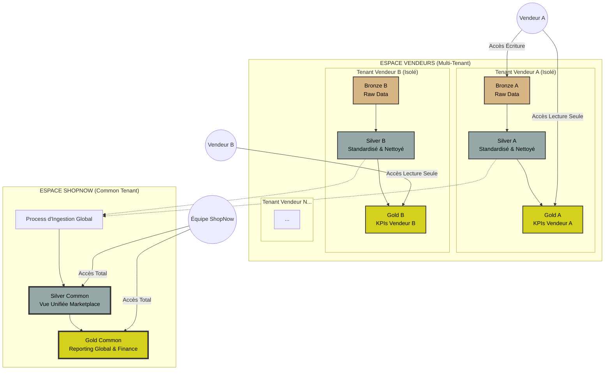
```mermaid
graph TD
    subgraph "ESPACE VENDEURS (Multi-Tenant)"
        direction TB
        
        subgraph "Tenant Vendeur A (Isolé)"
            BA[Bronze A\nRaw Data] --> SA[Silver A\nStandardisé & Nettoyé]
            SA --> GA[Gold A\nKPIs Vendeur A]
        end
        
        subgraph "Tenant Vendeur B (Isolé)"
            BB[Bronze B\nRaw Data] --> SB[Silver B\nStandardisé & Nettoyé]
            SB --> GB[Gold B\nKPIs Vendeur B]
        end
        
        subgraph "Tenant Vendeur N..."
            BN[...]
        end
    end

    subgraph "ESPACE SHOPNOW (Common Tenant)"
        direction TB
        Ingest[Process d'Ingestion Global]
        
        SA -.-> Ingest
        SB -.-> Ingest
        
        Ingest --> S_Common[Silver Common\nVue Unifiée Marketplace]
        S_Common --> G_Common[Gold Common\nReporting Global & Finance]
    end

    %% Access rules
    UserA((Vendeur A)) -->|Accès Lecture Seule| GA
    UserA -->|Accès Écriture| BA
    UserB((Vendeur B)) -->|Accès Lecture Seule| GB
    UserSN((Équipe ShopNow)) -->|Accès Total| S_Common
    UserSN -->|Accès Total| G_Common

    style S_Common fill:#96a8a8,stroke:#333,stroke-width:4px,color:#000
    style G_Common fill:#d4d11e,stroke:#333,stroke-width:4px,color:#000
    style BA fill:#D7B584,stroke:#333,stroke-width:2px,color:#000
    style BB fill:#D7B584,stroke:#333,stroke-width:2px,color:#000
    style SA fill:#96a8a8,stroke:#333,stroke-width:2px,color:#000
    style SB fill:#96a8a8,stroke:#333,stroke-width:2px,color:#000
    style GA fill:#d4d11e,stroke:#333,stroke-width:2px,color:#000
    style GB fill:#d4d11e,stroke:#333,stroke-width:2px,color:#000

```

### Plus de détail au sujet des Zones dans chaque Tenant :

#### Les Tenants Vendeur (L'espace restreint par vendeur)

C'est une structure de dossiers ou conteneurs (sur Azure Data Lake Gen2 ou S3) dédiée à chaque `Seller_ID`.
Chaque vendeur a accès uniquement à son propre tenant.

  * **Zone Bronze (Landingzone)** :

      * **Accès :** Vendeur (Écriture), ShopNow (Écriture).
      * **Processus :** Un pipeline ETL/ELT lit ces fichiers bruts pour les transformer et les charger dans la table Bronze.
      * **Contenu :** Fichiers bruts déposés par le vendeur (CSV, JSON, XML) ou poussés par API.
      * **Exemple :** `produits_vendeur_Machin_26112025.csv` (avec des colonnes mal nommées).

  * **Zone Silver (Standardisation Locale)** :

      * **Accès :** ShopNow (Lecture/Écriture), Vendeur (Lecture seule).
      * **Processus :** Un script ShopNow tourne ici pour appliquer le Data Model. Dans le DWH, on renomme les colonnes, on caste les types.
      * **Contenu :** Données propres mais limitées aux données de CE vendeur uniquement.
      * **Exemple :** Table Delta `products` avec colonnes standardisées (`product_id`, `price`, `stock`).

  * **Zone Gold (Reporting Vendeur)** :

      * **Accès :** Vendeur (Lecture via Portail), ShopNow (Lecture/Écriture).
      * **Contenu :** Les agrégats pré-calculés pour le vendeur. C'est ce qui alimente son tableau de bord dans le portail "Seller Center".
      * **Exemple :** "Mes ventes du mois", "Mon taux de retour".

#### Le Tenant ShopNow (L'espace exclusivement réservé à ShopNow)

C'est la zone qui est interdite aux vendeurs de la marketplace. C'est ici que se trouve le Data Warehouse global.

  * **Ingestion "Many-to-One" :**

      * Un pipeline ETL vient lire toutes les tables **Silver** des vendeurs (A, B, C...).
      * Il les fusionne (UNION ALL) en ajoutant une colonne `source_seller_id` et `source_seller_name` pour tracer l'origine de chaque ligne.
      * des colonnes techniques sont ajoutées (horodatage de l'ingestion).

  * **Zone Silver (Consolidation)** :

      * C'est ici qu'on gère les dédoublonnages globaux.
      * *Exemple :* La table `dim_product_global`. Si le Vendeur A et le Vendeur B vendent le même produit (même EAN), c'est ici qu'on le détecte.

  * **Zone Gold (Décisionnel)** :

      * Modèle en étoile complet pour ShopNow.
      * Calcul des commissions, marge globale, performance comparée des vendeurs.

-----

### schéma mermaid récapitulatif de l'architecture multi-tenant proposée

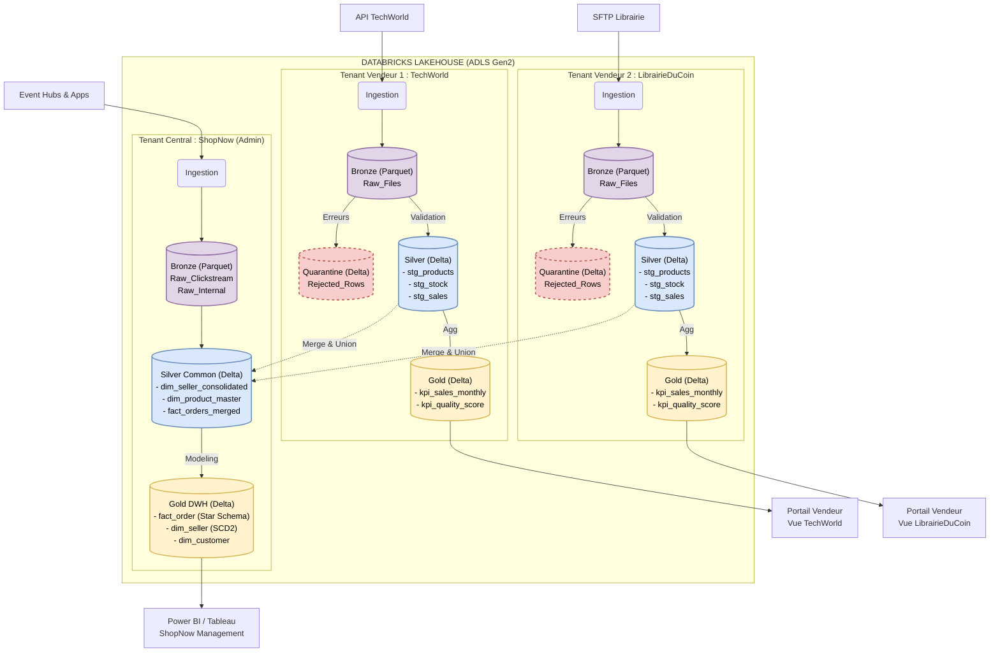
```mermaid
graph TD
    %% --- Styles ---
    classDef bronze fill:#e1d5e7,stroke:#9673a6,stroke-width:2px, color:#000;
    classDef silver fill:#dae8fc,stroke:#6c8ebf,stroke-width:2px, color:#000;
    classDef gold fill:#fff2cc,stroke:#d6b656,stroke-width:2px, color:#000;
    classDef quarantine fill:#f8cecc,stroke:#b85450,stroke-width:2px,color:#000, stroke-dasharray: 5 5;
    classDef process fill:#f5f5f5,stroke:#666,stroke-width:1px,rx:5,ry:5;

    %% --- Sources ---
    SourceA[API TechWorld] --> IngestA(Ingestion)
    SourceB[SFTP Librairie] --> IngestB(Ingestion)
    SourceInt[Event Hubs & Apps] --> IngestShop(Ingestion)

    subgraph "DATABRICKS LAKEHOUSE (ADLS Gen2)"
        
        %% --- TENANT 1 : TechWorld ---
        subgraph "Tenant Vendeur 1 : TechWorld"
            direction TB
            B_TW[("Bronze (Parquet)\nRaw_Files")]:::bronze
            Q_TW[("Quarantine (Delta)\nRejected_Rows")]:::quarantine
            S_TW[("Silver (Delta)\n- stg_products\n- stg_stock\n- stg_sales")]:::silver
            G_TW[("Gold (Delta)\n- kpi_sales_monthly\n- kpi_quality_score")]:::gold
            
            IngestA --> B_TW
            B_TW -->|Validation| S_TW
            B_TW -->|Erreurs| Q_TW
            S_TW -->|Agg| G_TW
        end

        %% --- TENANT 2 : LibrairieDuCoin ---
        subgraph "Tenant Vendeur 2 : LibrairieDuCoin"
            direction TB
            B_LC[("Bronze (Parquet)\nRaw_Files")]:::bronze
            Q_LC[("Quarantine (Delta)\nRejected_Rows")]:::quarantine
            S_LC[("Silver (Delta)\n- stg_products\n- stg_stock\n- stg_sales")]:::silver
            G_LC[("Gold (Delta)\n- kpi_sales_monthly\n- kpi_quality_score")]:::gold

            IngestB --> B_LC
            B_LC -->|Validation| S_LC
            B_LC -->|Erreurs| Q_LC
            S_LC -->|Agg| G_LC
        end

        %% --- TENANT COMMUN : ShopNow ---
        subgraph "Tenant Central : ShopNow (Admin)"
            direction TB
            B_SN[("Bronze (Parquet)\nRaw_Clickstream\nRaw_Internal")]:::bronze
            
            S_SN[("Silver Common (Delta)\n- dim_seller_consolidated\n- dim_product_master\n- fact_orders_merged")]:::silver
            
            G_SN[("Gold DWH (Delta)\n- fact_order (Star Schema)\n- dim_seller (SCD2)\n- dim_customer")]:::gold

            IngestShop --> B_SN
            B_SN --> S_SN
            
            %% La consolidation magique
            S_TW -.->|Merge & Union| S_SN
            S_LC -.->|Merge & Union| S_SN
            
            S_SN -->|Modeling| G_SN
        end
    end

    %% --- Consommateurs ---
    G_TW --> PortalA[Portail Vendeur\n Vue TechWorld]
    G_LC --> PortalB[Portail Vendeur\n Vue LibrairieDuCoin]
    G_SN --> PBI[Power BI / Tableau\n ShopNow Management]
```

### schéma mermaid avec une vue des tables Delta dans chaque Tenant

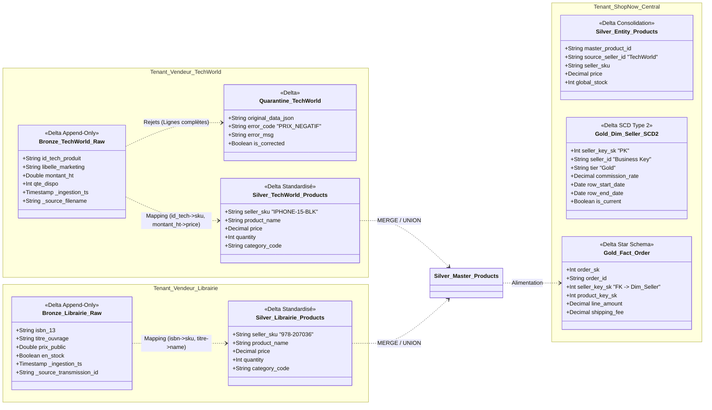
```mermaid
classDiagram
    direction LR

    %% ====================================================
    %% TENANT 1 : TechWorld (Vendeur High-Tech)
    %% Source : API JSON -> Bronze Structuré (Miroir)
    %% ====================================================
    namespace Tenant_Vendeur_TechWorld {
        class Bronze_TechWorld_Raw {
            <<Delta Append-Only>>
            %% Colonnes hétérogènes (Noms d'origine)
            +String id_tech_produit
            +String libelle_marketing
            +Double montant_ht
            +Int qte_dispo
            %% Colonnes Techniques
            +Timestamp _ingestion_ts
            +String _source_filename
        }
        
        class Quarantine_TechWorld {
            <<Delta>>
            +String original_data_json
            +String error_code "PRIX_NEGATIF"
            +String error_msg
            +Boolean is_corrected
        }

        class Silver_TechWorld_Products {
            <<Delta Standardisé>>
            %% Colonnes ShopNow (Renommées & Castées)
            +String seller_sku "IPHONE-15-BLK"
            +String product_name
            +Decimal price
            +Int quantity
            +String category_code
        }
    }

    %% ====================================================
    %% TENANT 2 : LibrairieDuCoin (Vendeur Livres)
    %% Source : XML -> Bronze Structuré (Miroir)
    %% ====================================================
    namespace Tenant_Vendeur_Librairie {
        class Bronze_Librairie_Raw {
            <<Delta Append-Only>>
            %% Colonnes hétérogènes (Noms d'origine)
            +String isbn_13
            +String titre_ouvrage
            +Double prix_public
            +Boolean en_stock
            %% Colonnes Techniques
            +Timestamp _ingestion_ts
            +String _source_transmission_id
        }

        class Silver_Librairie_Products {
            <<Delta Standardisé>>
            %% Colonnes ShopNow (Renommées & Castées)
            +String seller_sku "978-207036"
            +String product_name
            +Decimal price
            +Int quantity
            +String category_code
        }
    }

    %% ====================================================
    %% TENANT CENTRAL : ShopNow (Admin)
    %% Source : Aggregation des Silvers Vendeurs + Interne
    %% ====================================================
    namespace Tenant_ShopNow_Central {
        
        class Silver_Entity_Products {
            <<Delta Consolidation>>
            +String master_product_id
            +String source_seller_id "TechWorld"
            +String seller_sku
            +Decimal price
            +Int global_stock
        }

        class Gold_Dim_Seller_SCD2 {
            <<Delta SCD Type 2>>
            +Int seller_key_sk "PK"
            +String seller_id "Business Key"
            +String tier "Gold"
            +Decimal commission_rate
            +Date row_start_date
            +Date row_end_date
            +Boolean is_current
        }

        class Gold_Fact_Order {
            <<Delta Star Schema>>
            +Int order_sk
            +String order_id
            +Int seller_key_sk "FK -> Dim_Seller"
            +Int product_key_sk
            +Decimal line_amount
            +Decimal shipping_fee
        }
    }

    %% RELATIONS LOGIQUES (Transformation)
    %% Mapping des colonnes TechWorld vers Standard
    Bronze_TechWorld_Raw ..> Silver_TechWorld_Products : Mapping (id_tech->sku, montant_ht->price)
    Bronze_TechWorld_Raw ..> Quarantine_TechWorld : Rejets (Lignes complètes)

    %% Mapping des colonnes Librairie vers Standard
    Bronze_Librairie_Raw ..> Silver_Librairie_Products : Mapping (isbn->sku, titre->name)

    %% La magie de la standardisation : Tout va dans le Master
    Silver_TechWorld_Products ..> Silver_Master_Products : MERGE / UNION
    Silver_Librairie_Products ..> Silver_Master_Products : MERGE / UNION

    Silver_Master_Products ..> Gold_Fact_Order : Alimentation
```


### Points forts de cette architecture :

- Isolation des données : En gérant les droits d'accès au niveau du dossier racine du Tenant Vendeur (RBAC), nous garantissons techniquement qu'un vendeur ne pourra jamais, même par erreur de requête, accéder aux données d'un autre.
- Scalabilité : Si le Vendeur A envoie 1 To de données et le Vendeur B 1 Ko, cela n'impacte pas la performance des autres. Nous pouvons même allouer des ressources de calcul dédiées par tenant si besoin. 
- Traçabilité (grâce au Lineage) : Si une donnée est fausse dans le Gold Commun, il est possible remonter la chaîne : depuis Gold > silver vendeur > raw vendeur. Nous pouvons retrouver exactement quel fichier source est coupable. 
- Monétisation : A terme, shopnow pourra proposer aux vendeurs marketplace d'accéder à des données anonymisées du "Gold Common" (benchmarking : "Comment je me situe par rapport à la moyenne du marché ?").


### ANNEXES

## pourquoi choisir de relier la table dim_seller à fact_order et non à dim_product sachant qu'une commande peut-être multi-vendeur
--> on pourrait considérer les vendeurs comme des fournisseurs de produits et relier les produits aux vendeurs ?

Plusieurs problèmes techniques se posent si on relie `dim_seller` à `dim_product` :

**A. Le problème du "Produit Unique" vs "Vendeurs Multiples"**
Sur une Marketplace, le produit "iPhone 15 Noir 128Go" est unique (il a un code EAN unique). C'est ta ligne dans `dim_product`.
Cependant, ce *même* produit peut être vendu par 10 vendeurs différents (Apple, Fnac, VendeurTiers_XYZ).
* Si tu mets la clé vendeur dans `dim_product`, tu es obligé de dupliquer la ligne produit 10 fois (une par vendeur). Tu casses l'unicité de ton référentiel produit.

**B. La granularité de la commande (Fact Order)**
La table `fact_order` ne représente pas le "panier" global, mais la **ligne de commande** (un produit acheté).
Si une commande est multi-vendeurs :
* Ligne 1 : iPhone (lié à `dim_product`) -> acheté au vendeur A (lié à `dim_seller`).
* Ligne 2 : Coque (liée à `dim_product`) -> achetée au vendeur B (lié à `dim_seller`).

**Conclusion :**
C'est la **transaction** qui scelle le lien entre un produit et un vendeur à un instant T. 
Le lien doit donc se faire dans la table de faits.
Il faut relier `dim_seller` à **`fact_order`**.


Plan pour rédaction : 

I. diagnostic : Analyse et limites de l’architecture actuelle :
- analyse de l’architecture existante du Data Warehouse (ce qu'elle permet actuellement)
- identification des nouveaux enjeux (historisation des vendeurs, volume et variété des données, granularité)
- risques liés à la transformation en Marketplace (tracabilité, qualité des données, sécurité des données)

II. propositions d’évolutions : Adaptations structurelles et techniques :
modifications du modèle de données (ajout de dimension vendeur, adaptation de la table de faits, gestion des SCD) 
+ justifier pourquoi on utilise une clé technique de versionnage vendeur (seller_key) = pour figer l'état du vendeur lors de la vente, 
+ et pourquoi une clé métier seller_id : identifiant unique du vendeur, reste constante dans le temps

ce modèle permet une souplesse d’analyse et une traçabilité des transactions : 
- pour les vendeurs : 
- il permet d’isoler les données par vendeur pour des analyses ciblées (par produit etc.)
- 
- il facilite la gestion des évolutions des vendeurs dans le temps (pour Shopnow)


C'est très clair. En effet, la partie précédente couvrait l'**Architecture** et la **Modélisation** (le "Design"). Les points que tu listes maintenant concernent le **MCO (Maintien en Conditions Opérationnelles)**, l'**Exploitation** et les **Procédures Techniques**.

Voici le complément indispensable pour ton dossier. Tu peux l'intégrer comme une grande partie "Exploitation et Maintenance" ou "Manuel des Opérations".

---

# Dossier d'Exploitation et de Maintenance (MCO)

## 1. Organisation de la Maintenance et Support (ITIL)

### 1.1. Méthodologie et Outillage

Nous mettons en place un **Centre de Services** aligné sur les bonnes pratiques ITIL pour gérer les incidents et les demandes de travaux.

* **Outil de Ticketing :** **Jira Service Management** (ou Azure DevOps Boards).
* Il centralise les tickets entrants (bugs, demandes d'accès, évolutions).
* Il est lié au repository de code (Git) pour la traçabilité des modifications.


* **Niveaux de Support :**
* **Niveau 1 (Service Desk) :** Qualification de la demande (ex: "Je n'accède pas au rapport"). Résolution simple (reset mot de passe).
* **Niveau 2 (Data Ops) :** Relance de pipelines échoués, analyse de logs d'erreur, gestion des accès complexes.
* **Niveau 3 (Data Engineers) :** Correction de bugs de code, modification des modèles de données (SCD), évolution d'architecture.


### 1.2. Priorisation et SLAs (Service Level Agreements)

La priorisation est définie par une matrice **Urgence x Impact**.

| Priorité | Définition | SLA de Prise en compte | SLA de Résolution |
| --- | --- | --- | --- |
| **P1 - Critique** | DWH inaccessible ou Données Vendeurs corrompues (Impact Financier). | 15 min | 4h |
| **P2 - Majeur** | Retard d'ingestion (>4h), rapport clé indisponible. | 1h | 8h |
| **P3 - Mineur** | Demande d'évolution, bug cosmétique, ajout d'accès. | 4h | 5 jours ouvrés |

### 1.3. Suivi des Indicateurs (KPIs MCO)

Un tableau de bord "Ops" suit la santé du service :

* **Disponibilité du DWH :** Taux d'uptime (Cible : 99.9%).
* **Fraîcheur des données :** Retard moyen par rapport à l'heure prévue de mise à disposition (SLA : 8h00 matin).
* **Qualité :** Nombre de lignes rejetées en quarantaine par jour.
* **Ticket Volume :** Nombre de tickets ouverts/fermés par semaine.

---

## 2. Observabilité : Alerting et Journalisation

L'objectif est de passer d'une maintenance réactive (on attend que ça casse) à une maintenance proactive.

### 2.1. Configuration de la Journalisation (Logging)

Tous les composants (Azure SQL, Data Lake, Pipelines ETL) envoient leurs télémétries vers **Azure Monitor** et **Log Analytics Workspace**.

* **Logs d'Infrastructure :** CPU, RAM, IOPS de la base SQL (détection des goulots d'étranglement).
* **Logs Applicatifs (ETL) :**
* Début/Fin de chaque job d'ingestion.
* Nombre de lignes lues vs écrites (Audit).
* Messages d'erreur détaillés (Stack Trace).


### 2.2. Gestion des Alertes

Des règles d'alertes sont configurées pour notifier l'équipe d'astreinte (Email + Teams/Slack).

* **Alerte "Pipeline Failure" :** Si un job ETL échoue ou dure plus de 2x sa durée habituelle.
* **Alerte "Data Quality" :** Si le taux de rejet en quarantaine dépasse 5% sur un fichier.
* **Alerte "Performance" :** Si le DTU (puissance de calcul) de la base SQL dépasse 90% pendant 15 minutes.

---

## 3. Stratégie de Sauvegarde (Backup) et PRA

Pour garantir la résilience des données face aux erreurs humaines ou pannes techniques.

### 3.1. Base de Données (Azure SQL - Gold & Silver)

* **Backups Complets (Full) :** Automatisés par Azure chaque semaine.
* **Backups Différentiels :** Toutes les 12 à 24 heures.
* **Logs de Transaction :** Toutes les 5 à 10 minutes (permet le *Point-in-Time Restore*).
* **Rétention :**
* Court terme : 7 jours (Restauration immédiate).
* Long terme (LTR) : 1 backup mensuel conservé 5 ans (Obligation légale/finance).


### 3.2. Data Lake (Bronze - Fichiers sources)

* **Soft Delete :** Activé (permet de récupérer un fichier supprimé par erreur pendant 7 jours).
* **Versioning :** Activé sur le Blob Storage (permet de revenir à une version précédente d'un fichier écrasé).
* **Réplication :** GRS (Geo-Redundant Storage). Les données sont copiées dans une région secondaire (ex: Paris -> Marseille) en cas de désastre majeur.

---

## 4. Procédures d'Évolution et Scalabilité

Cette section documente "Comment faire grandir l'entrepôt".

### 4.1. Ajout d'une nouvelle source de données

*Procédure standardisée pour intégrer un nouveau vendeur ou une nouvelle API :*

1. **Déclaration :** Création du Container dédié dans le Data Lake (via Terraform).
2. **Mapping :** Définition du fichier de mapping (Source Colonne A -> Cible Colonne B) dans la configuration de l'ETL.
3. **Tests :** Ingestion en environnement de recette et validation de la mise en quarantaine.
4. **Déploiement :** Passage en production via pipeline CI/CD.

### 4.2. Gestion des Accès (Sécurité)

Utilisation exclusive des **Groupes Azure Active Directory (Entra ID)**. Jamais d'accès nominatif direct.

* *Scénario :* "Arrivée d'un nouveau contrôleur de gestion".
* *Action :* On ajoute l'utilisateur au groupe `GRP_SHOPNOW_FINANCE`. Ce groupe a automatiquement les droits `db_datareader` sur le schéma `Finance` du DWH.

### 4.3. Scalabilité du Stockage

* **Data Lake :** Scalabilité infinie native. Aucune action requise.
* **Azure SQL :** Surveillance du taux d'occupation. Si > 80%, script Terraform pour augmenter la classe de service (Scale Up) ou ajout de stockage.

---

## 5. Gestion des Variations de Dimensions (SCD)

C'est la documentation technique de ta modélisation "Vendeur" (réponse directe à ta consigne sur Kimball).

### 5.1. Modélisation des Variations (Choix Kimball)

Nous utilisons deux types de variations selon le besoin métier :

| Type SCD | Description | Usage chez ShopNow | Exemple |
| --- | --- | --- | --- |
| **Type 1** | **Écrasement (Overwrite).** On ne garde pas l'historique. | Correction d'erreurs (ex: Faute de frappe dans le nom du vendeur). | "TehWorld" devient "TechWorld". |
| **Type 2** | **Historisation (New Row).** On crée une nouvelle ligne pour chaque changement. | Changements d'état impactant le business (Finance). | Passage de commission 15% à 10%. |

### 5.2. Intégration Technique (ETL)

Voici la logique implémentée dans les pipelines ETL pour gérer le SCD Type 2 sur `dim_seller`.

**Algorithme de l'ETL (Pseudo-code) :**

1. **Comparaison :** On compare le fichier source entrant avec la table `dim_seller` actuelle (sur la clé métier `seller_id`).
2. **Détection de changement :** Si le `seller_id` existe MAIS que le `tier` ou `commission` est différent.
3. **Clôture (Update) :** On met à jour l'ancienne ligne :
* `row_end_date` = Date du jour - 1 seconde.
* `is_current` = 0 (Faux).


4. **Insertion (Insert) :** On insère la nouvelle ligne :
* `seller_key` = (Généré auto).
* `row_start_date` = Date du jour.
* `row_end_date` = NULL.
* `is_current` = 1 (Vrai).


### 5.3. Documentation et Mise à jour des Modèles

Toute modification de la structure (ajout d'une colonne SCD) suit ce cycle :

1. Mise à jour du **Modèle Logique de Données (MLD)** dans l'outil de modélisation (ex: PowerDesigner ou Mermaid).
2. Mise à jour du **Dictionnaire de Données** (Data Catalog).
3. Mise à jour du code **Terraform/SQL**.

---

### Schéma visuel pour la section SCD (Optionnel mais recommandé)

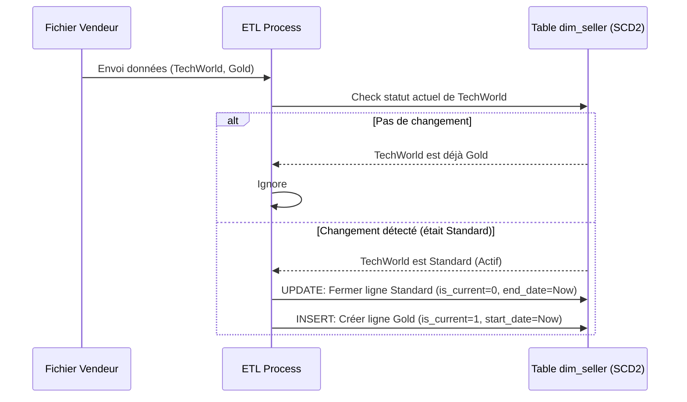
```mermaid
sequenceDiagram
    participant Source as Fichier Vendeur
    participant ETL as ETL Process
    participant Dim as Table dim_seller (SCD2)
    
    Source->>ETL: Envoi données (TechWorld, Gold)
    ETL->>Dim: Check statut actuel de TechWorld
    
    alt Pas de changement
        Dim-->>ETL: TechWorld est déjà Gold
        ETL->>ETL: Ignore
    else Changement détecté (était Standard)
        Dim-->>ETL: TechWorld est Standard (Actif)
        ETL->>Dim: UPDATE: Fermer ligne Standard (is_current=0, end_date=Now)
        ETL->>Dim: INSERT: Créer ligne Gold (is_current=1, start_date=Now)
    end

```

Avec cet ajout, tu couvres **l'intégralité** des points de ta liste de consignes, notamment les aspects procéduraux (Backup, Alertes, Documentation) et la technicité des SCD.


C'est une excellente stratégie. Pour un rapport technique, **une image (preuve) vaut 1000 mots**. Ça aère le document et ça prouve que tu n'as pas fait que du théorique, mais que tu as touché à l'outil.

Vu qu'il te reste ~5 pages, voici les **3 démonstrations clés** à faire pour couvrir les points restants (SCD, Monitoring, Backup) avec les scripts pour générer les screenshots.

---

### PAGE 6-7 : La Gestion des Variations (SCD Type 2) - La Preuve par l'exemple

C'est le point technique le plus valorisant (Kimball). Il faut montrer que ton code SQL gère l'histoire du vendeur.

**Ce que tu dois faire :**

1. Va dans le **Query Editor** Azure.
2. Lance ce scénario de démonstration (Copie-colle le bloc ci-dessous).
3. **Screenshotte le résultat du dernier SELECT.**

```sql
-- SCÉNARIO DE DÉMO SCD TYPE 2 --

-- 1. État Initial : TechWorld arrive sur la marketplace (Janvier)
INSERT INTO dim_seller (seller_id, name, tier, commission_rate, row_start_date, row_end_date, is_current)
VALUES ('V_TECH_001', 'TechWorld', 'Standard', 0.15, '2024-01-01', NULL, 1);

-- 2. Évolution : TechWorld devient performant et passe GOLD (Juin)
-- A. On ferme l'ancienne ligne
UPDATE dim_seller 
SET row_end_date = '2024-05-31', is_current = 0 
WHERE seller_id = 'V_TECH_001' AND is_current = 1;

-- B. On ouvre la nouvelle ligne
INSERT INTO dim_seller (seller_id, name, tier, commission_rate, row_start_date, row_end_date, is_current)
VALUES ('V_TECH_001', 'TechWorld', 'Gold', 0.12, '2024-06-01', NULL, 1);

-- 3. PREUVE : On regarde l'histoire du vendeur
SELECT 
    seller_key AS [Clé Technique], 
    seller_id AS [ID Vendeur], 
    tier AS [Statut], 
    commission_rate AS [Com (%)],
    row_start_date AS [Début], 
    row_end_date AS [Fin], 
    is_current AS [Actif ?]
FROM dim_seller 
WHERE seller_id = 'V_TECH_001'
ORDER BY seller_key;

```

**Légende du screenshot dans ton rapport :**

> *"Figure X : Mise en œuvre du SCD Type 2. On constate bien deux lignes pour le vendeur TechWorld. La première (Standard) est fermée, la seconde (Gold) est active. L'historique est préservé."*

---

### PAGE 8 : L'Observabilité (Logs et Alertes)

Il faut montrer que l'entrepôt est sous surveillance (le fameux "MCO").

**Ce que tu dois faire sur le Portail Azure :**

1. Va sur ta **SQL Database**.
2. Dans le menu de gauche, cherche la section **Monitoring** > **Alerts**.
3. Clique sur "+ Create" (ou juste montre l'écran vide si tu ne veux pas configurer).
4. Alternative plus visuelle : Va dans l'onglet **Metrics**.
5. Sélectionne la métrique **"DTU percentage"** (puissance utilisée).
6. **Screenshotte le graphique.**

**Légende du screenshot :**

> *"Figure Y : Tableau de bord de surveillance Azure Monitor. Configuration d'une alerte critique si l'utilisation du DTU dépasse 80%, garantissant la détection proactive des goulots d'étranglement lors des chargements ETL."*

---

### PAGE 9 : Sécurité et Backups (PRA)

Tu dois répondre à l'exigence de "procédure de backup". Sur Azure, c'est natif, il suffit de le montrer.

**Ce que tu dois faire sur le Portail Azure :**

1. Va sur ta **SQL Database**.
2. Dans le menu du haut, clique sur le bouton **"Restore"** (ne t'inquiète pas, ça ne lance rien tout de suite).
3. Tu arrives sur une page avec une option "Point-in-time restore" et un curseur temporel.
4. **Screenshotte cette interface avec le curseur de temps.**

**Légende du screenshot :**

> *"Figure Z : Interface de restauration Point-in-Time (PITR). Le système permet de restaurer l'entrepôt de données à la seconde près sur les 7 derniers jours, assurant la résilience face aux erreurs humaines (ex: suppression accidentelle)."*

---

### PAGE 10 : Organisation du Support (Diagramme)

Pour finir sur la partie "Organisationnelle" (ITIL / Tickets), plutôt qu'un long texte, fais un diagramme simple qui résume le processus. Ça remplit bien la page.

**Diagramme Mermaid à insérer :**

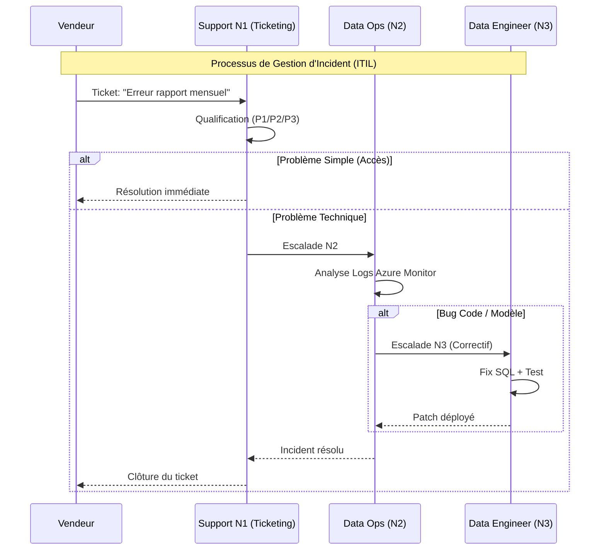
```mermaid
sequenceDiagram
    participant Vendeur
    participant Support as Support N1 (Ticketing)
    participant Ops as Data Ops (N2)
    participant Eng as Data Engineer (N3)

    Note over Vendeur, Eng: Processus de Gestion d'Incident (ITIL)

    Vendeur->>Support: Ticket: "Erreur rapport mensuel"
    Support->>Support: Qualification (P1/P2/P3)
    
    alt Problème Simple (Accès)
        Support-->>Vendeur: Résolution immédiate
    else Problème Technique
        Support->>Ops: Escalade N2
        Ops->>Ops: Analyse Logs Azure Monitor
        
        alt Bug Code / Modèle
            Ops->>Eng: Escalade N3 (Correctif)
            Eng->>Eng: Fix SQL + Test
            Eng-->>Ops: Patch déployé
        end
        
        Ops-->>Support: Incident résolu
        Support-->>Vendeur: Clôture du ticket
    end

```

**Texte d'accompagnement (bref) :**

> *"L'organisation du support suit une matrice de responsabilité stricte. Le niveau 1 filtre les demandes, le niveau 2 gère l'exploitation courante via les logs Azure présentés page 8, et le niveau 3 intervient sur les évolutions structurelles du modèle présenté page 6."*

---

### Résumé de ton plan final (10 pages)

* **Page 1-2 :** Diagnostic & Architecture As-Is vs To-Be (Tes schémas couleur).
* **Page 3-4 :** Le Data Lake Multi-Tenant (Ton schéma architecture détaillée).
* **Page 5 :** Gouvernance & Qualité (Tableau des 3 temps / Quarantaine).
* **Page 6-7 :** **Implémentation SCD Type 2** (Avec le Screenshot SQL).
* **Page 8 :** **Surveillance** (Avec le Screenshot Azure Monitor).
* **Page 9 :** **Backup & Sécurité** (Avec le Screenshot Restore).
* **Page 10 :** **Processus Support** (Avec le Diagramme ITIL).

schéma d'architecture du hub 

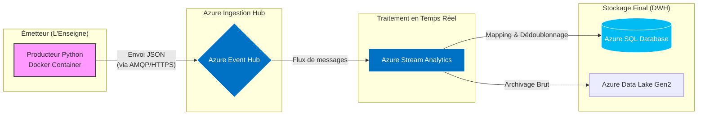
```mermaid
graph LR
    subgraph "Émetteur (L'Enseigne)"
        A[Producteur Python<br/>Docker Container]
    end

    subgraph "Azure Ingestion Hub"
        B{Azure Event Hub}
    end

    subgraph "Traitement en Temps Réel"
        C[Azure Stream Analytics]
    end

    subgraph "Stockage Final (DWH)"
        D[(Azure SQL Database)]
        E[Azure Data Lake Gen2]
    end

    A -- "Envoi JSON<br/>(via AMQP/HTTPS)" --> B
    B -- "Flux de messages" --> C
    C -- "Mapping & Dédoublonnage" --> D
    C -- "Archivage Brut" --> E

    style A fill:#f9f,stroke:#333,stroke-width:2px
    style B fill:#0072C6,stroke:#fff,color:#fff
    style C fill:#0072C6,stroke:#fff,color:#fff
    style D fill:#00BCF2,stroke:#fff,color:#fff
```

Anonymisation Schema 

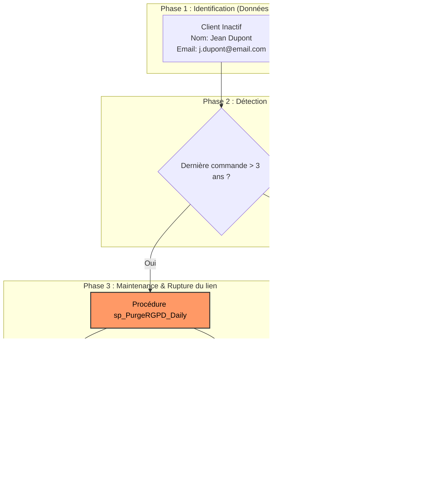
```mermaid
graph TD
    subgraph "Phase 1 : Identification (Données PII)"
        A[Client Inactif<br/>Nom: Jean Dupont<br/>Email: j.dupont@email.com]
    end

    subgraph "Phase 2 : Détection (Logic App)"
        B{Dernière commande > 3 ans ?}
    end

    subgraph "Phase 3 : Maintenance & Rupture du lien"
        C[Procédure sp_PurgeRGPD_Daily]
        C1[UPDATE fact_order<br/>SET user_id = 'DELETED_RGPD']
        C2[DELETE FROM dim_customer]
    end

    subgraph "Phase 4 : État Final (Pseudonymisation)"
        D[Vente conservée<br/>ID: DELETED_RGPD]
        E[Profil Client<br/>SUPPRIMÉ]
    end

    A --> B
    B -- "Oui" --> C
    C --> C1
    C --> C2
    C1 --> D
    C2 --> E
    B -- "Non" --> F[Conservation Intégrale]
    
    style C fill:#f96,stroke:#333,stroke-width:2px,color:#000
    style D fill:#d1ecf1,stroke:#0c5460,color:#0c5460
    style E fill:#f8d7da,stroke:#721c24,color:#721c24
    
```

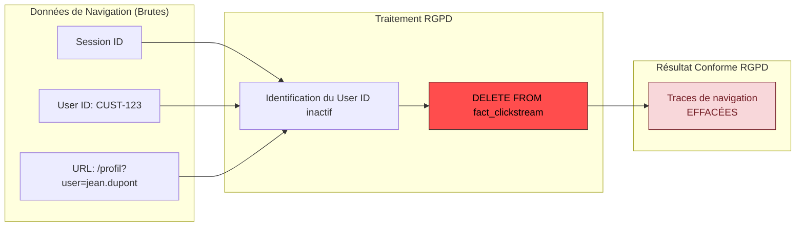
```mermaid
graph LR
    subgraph "Données de Navigation (Brutes)"
        A[Session ID]
        B[User ID: CUST-123]
        C[URL: /profil?user=jean.dupont]
    end

    subgraph "Traitement RGPD"
        D[Identification du User ID inactif]
        E[DELETE FROM fact_clickstream]
    end

    subgraph "Résultat Conforme RGPD"
        F[Traces de navigation<br/>EFFACÉES]
    end

    A --> D
    B --> D
    C --> D
    D --> E
    E --> F
    
    style E fill:#ff4d4d,stroke:#333,color:#000
    style F fill:#f8d7da,stroke:#721c24,color:#721c24
```